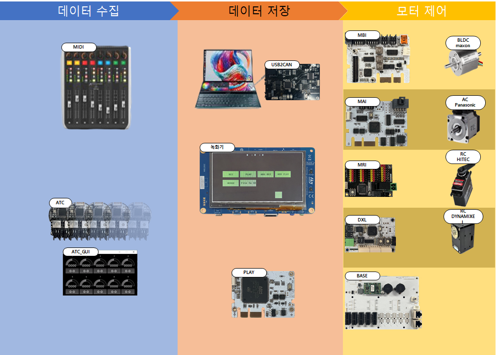

# Introduction
## 1.1 시스템 설명
모션 오브제 제작시 모션 제작의 어려움과 함께 장기간 제작기간이 소요되므로, 모션 오브제 플랫폼이 필요하다. 
Motion Control System(이하 MCS)는 오브제 모션을 녹화하여 플레이 하는 시스템으로 오브제 구동을 위한 기능요소들을 모듈화 하여 각 기능 요구에 따라 필요한 모듈들을 조립하여 쓰는 형태로 이루어져 있다. 큰 특징은 다음과 같다. 

-	오브제 요구에 따라 각 모듈을 조립하여 사용
-	모션데이터 취득 장치(ex: MIDI)를 활용한 다양한 모션 연출 가능
-	다수, 다양한 모터 동시 사용가능
-	모터는 크게 AC, BLDC, Dynamixel, RC 총 4종류로 분류

Table 1 모터 분류 및 특성

|           | AC Servo Motor    | BLDC Motor           | Dynmixel Motor | RC servo Motor|
|:---------:|:-----------------:|:--------------------:|:--------------:|:-------------:|
|소비전력|100W 이상|10W~500W|낮음|낮음|
|전원|AC220|DC12V~72V|DC12V|DC5V~7.5V|
|모터토크|높음(조절가능)|높음(조절가능)|중간|낮음|
|모터속도|조절가능|조절가능|낮음|낮음|
|크기|큼|중간|작음|작음
|설치 난이도|높음|높음|낮음|낮음|
|가격|높음|중간|낮음|낮음|
|배터리 사용여부|불가능|가능|가능|가능|

## 1.2 시스템 구성

## 1.3 시스템 영상

<video id="1_3" width="400" height="600" src="../01/1_3.mp4" controls preload="false"></video>

## 1.4 시스템 구성 분류

### 1.4.1 구성 장치

|분류|명칭|내용|제조사|
|:------:|:------:|:------:|:------:|
|액추에이터|AC Servo Motor|속도제어, 위치제어 가능|파나소닉|
|액추에이터|BLDC Motor|정밀 속도 제어 가능|맥슨|
|액추에이터|RC Servo Motor|속도제어, 위치제어 가능|하이텍|
|액추에이터|Dynamixel Motor|속도제어, 위치제어 가능|로보티즈|
|액추에이터|AC Servo AMP| AC Servo Motor 제어 드라이버|파나소닉|
|모션컨트롤러|MAI|AC모터를 제어|LAB|
|모션컨트롤러|MBI|BLDC모터를 제어|LAB|
|모션컨트롤러|PLAY|모션데이터를 재생|LAB|
|모션컨트롤러|POE|CAN Cable 전원 생성|LAB|
|모션컨트롤러|DXL|다이나믹셀 모터 제어|LAB|
|모션컨트롤러|ATC|Analog To CAN, 모션데이터 수집|LAB배
|모션컨트롤러|CTC|CAN To CAN, 통신프로토콜 변경|LAB|
|모션컨트롤러|USB2CAN|시스템과 PC연결 인터페이스 PCB|LAB|
|모션컨트롤러|MRI28|RC모터를 제어|LAB|
|모션컨트롤러|BASE|통신 및 전원 분배|LAB|
|설정장치|MIDI|AC모터를 제어|LAB|
|설정장치|녹화기|AC모터를 제어|LAB|
|설정장치|원점조종기(HFP-30)|AC모터를 제어|하이택|
|전원부|차단기|시스템 전원관리|선택|
|전원부|노이즈필터|시스템 전원관리|선택|
|전원부|SMPS|전자부품 전원|선택|
|전원부|전원단자대|전우너분개시 사용|선택|
|센서|원점센서|모터 원점, 리미트 설정시 사용|오토닉스|
|기타|메모리카드|모션 저장 메모리|선택|
|기타|카드리더기||선택

### 1.4.2 케이블

|분류|명칭|내용|제조사|
|:--:|:--:|:--:|:--:|
|통신케이블|CAN 통신 케이블|각 객체간 통신 케이블|선택|
|통신케이블|AC AMP 제어 케이블| AC Servo Motor 위치 제어 및 모니터|제작|
|통신케이블|원점 센서 케이블|모터 원점, 리미트에 사용(축당 2개)|제작|
|AC Servo Motor|Motor Power Cable|모터 전원(U, V, W, FG)|제작|
|AC Servo Motor|Encoder Cable|모터 회전 속도/방향|제작|
|AC Servo Motor|Brake Cable|Brake 타입 모터 전원 (DC24V사용)|제작|
|BLDC Motor|Motor Power Cable|모터 전원(U, V, W, FG)|제작|
|BLDC Motor|Hall Sensor Cable|모터 회전 속도 측정|제작|
|BLDC Motor|Encoder Cable|모터 회전 속도/방향|제작|
|RC Servo Motor|PWM Cable|모터 제어 신호|제작|

