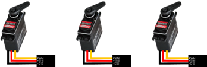

# Quick Start Tutorial

목표: Motion Recording System 구성과 사용방법에 대해 익히도록 한다.

## 2.1 RC Servo Motor 동작
MIDI(모션 데이터 수집장치)와 MRS를 이용하여 RC Servo Motor의 모션을 생성하고 플레이 한다.

### 2.1.1 준비 및 구성
#### 2.1.1.1 모터
RC BLDC 모터 3개(모델:HSB-9381 or HSB-9380)

#### 2.1.1.2 디바이스

#### 2.1.1.3 배선

##### ① 전원배선

- 220VAC 전원에 24V 어댑터와 SMPS(5~7VDC)연결 
- 24V 어댑터 POE에 연결 
- POE와 MIDI 통신 커넥터에 연결(두 포트 중 어느 곳에 꽂아도 무관)
- SMPS의 출력 전원을 MRI28 모터전원에 연결 
* 어댑터의 전원(220V)과 MIDI의 전원(220V)은 동일한 전원을 사용, 전원은 접지포함 되어있을 것.

##### ② CAN 통신 케이블 배선

- 녹화기와 통신 커넥터와 PLAY의 통신 커넥터 연결
- MRI28의 통신 케이블과 PLAY의 통신 커넥터 연결 (추후 제작 시 2층으로 꽂아 조립하여 사용하는 형태로 변경) 

##### ③ RC Servo Motor 연결: MRI28에 RC Motor 연결
- 모터 순서는 MRI28에 표기되어 있으며, 순차적으로 RC모터를 1~3번 연결한다. 
- 모터 커넥터의 케이블 방향 확인하면서 연결 

##### ④ 녹화기에 메모리카드(SD CARD) 삽입

### 2.1.2 파라미터 설정

#### 2.1.2.1 녹화기 파라미터 설정
PC 프로그램 실행: MGUI.exe 

##### ①	설정 폴더 생성
메모리 카드에 초기 조건을 충족시키기 위한 설정 폴더를 만든다 (영상 참조)
→ Media 폴더, Setting 폴더

#### 2.1.2.2 모터 축 설정
##### ①RC 모터 수량별로 추가 후 [모터 종류]를 선택한다 (추가: +ADD)

##### ②축 번호를 설정한다.

##### ③저장 후 PC프로그램 종료

### 2.1.3 모션

#### 2.1.3.1 모터 조작

##### ① 파라미터 설정이 완료된 메모리카드를 녹화기 SD CARD Slot에 삽입(삽입위치, 방향 사진 필요)
(SD CARD 삽입시 메모리카드를 끝까지 밀어 넣을 것)
##### ② MIDI의 전원 ON (전원버튼은 상부 측면에 위치)
: 버튼 점등, MIDI LCD 화면 점등, 슬라이드 1번 동작 후 슬라이드 하단부에서 멈춤

### 2.1.3.2 동작

① 1번 모터 움직여 보기

MIDI의 LCD에 표시된 1는 축 1번을 뜻한다. 번호 확인 후 첫번째 슬라이드 조작한다. 
: 1번 슬라이드의 조작 시 [1번 RC모터] 가 작동한다. (1-1)

② 2번 모터 움직여 보기

MIDI의 LCD에 표시된 ID2는 축2번을 뜻한다. 번호 확인 후 두번째 슬라이드를 조작한다. 
: 2번 슬라이드의 조작 시 [2번 RC모터] 가 작동한다.

③ 3번 모터 움직여 보기
MIDI의 LCD에 표시된 ID2는 축2번을 뜻한다. 번호 확인 후 두번째 슬라이드를 조작한다. 
: 3번 슬라이드의 조작 시 [2번 RC모터] 가 작동한다.

### 2.1.2 모드변경: 녹화/플레이

① 1번 모터 동작 만들기 
-녹화시작 
: 녹화기 UI에서 REC (녹화) 선택하고 MIDI의 1번 슬라이드를 조작하면, 1번 모터가 작동한다.  
녹화 진행 시 REC의 글자색이 빨강색으로 표시된다. 
-녹화종료 
: REC (녹화) 선택하면 녹화가 완료된다.  
녹화 종료 시 REC글자 색상은 검정색으로 표시된다.

-녹화플레이 
: PLAY(녹화 플레이) 선택하면 녹화가 완료된 모션데이터로 플레이 된다. 
 1번 모터가 녹화된 데이터로 작동한다. MIDI는 녹화된 데이터에 연동되어 움직인다. 

② 2번 모터 동작 추가하기 
(추가보단 생성의 의미이며 두개의 레이어를 가지고 덮어쓰기하고있다는 것을 도도식화하는 것 좋을것같음)

-추가 녹화시작 
: 녹화기 UI에서 [ADD REC] (추가 녹화) 선택하고 MIDI의 2번 슬라이드를 조작하면, 2번 모터가 작동한다. 녹화 진행 시 [ADD REC]의 글자색이 빨강색으로 표시된다. 
★처음 녹화를 진행했던 ①에서 녹화 완료된 1번모터가 플레이 되면서 추가 녹화가 진행.

-추가 녹화종료 
: [ADD REC] (추가 녹화) 선택하면 녹화가 완료된다. 
녹화 종료 시 ADD REC글자 색상은 검정색으로 표시된다. 

-추가 녹화플레이 
: [ADD PLAY] (추가 녹화 플레이) 선택하면 추가 녹화가 완료된 모션데이터로 플레이 된다. 
   처음 녹화된 ①번의 모션과 추가 녹화된 모션이 같이 플레이 된다. 

③ 모션 합치기 완료 
④ UI에서 [MERGE] (REC+ADD REC 병합) 선택해서 두개의 녹화를 병합한다. 
⑤ 모션 데이터 메모리에 저장 
UI에서 [File To SD] 선택해서 메모리카드에 저장한다.

## 2.2 RC Servo Motor + AC Servo Motor 동작 시키기

### 2.2.1 준비 및 구성
#### 2.2.1.1 모터 준비

- RC BLDC 모터 3개(사용한 모델: HSB-9381)  
- AC SERVO 모터 2개(사용한 모델: PANASONIC A6 시리즈)

#### 2.2.1.2 디바이스

① BASE보드 = MAI를 BASE Slot에 결합 
② MRI28 + RC모터 3개 연결 
③ 녹화기 + 메모리카드(SD CARD) 삽입 
④ 차단기 + 노이즈필터 + SMPS + 전원차단기 배선 
⑤ MIDI + 녹화기 + BASE 보드 통신케이블 연결 
⑥ AC DRIVE의 IO케이블을 AC모듈에 배선 
⑦ 센서케이블(CW, CCW)을 AC모듈에 배선 

#### 2.2.1.3 배선

①BASE보드: MAI Slot조립 
-BASE 보드에서 [③번] 보드전원 케이블을 SMPS와 연결(DC24V)
-BASE 보드에서 MRI28로 [④번] CAN통신 케이블 연결
-BASE 보드에서 녹화기로 [⑤번] CAN통신 케이블 연결
-AC모듈에 [⑦번] IO케이블 AC SERVO AMP에 연결

② MAR28 : MRI28에 RC모터 연결 
-축 순서는 MRI28에 표기되어 있으며, 순차적으로 RC모터를 1~3번 연결한다. 
-모터 커넥터의 케이블 방향 확인하면서 연결 

-MRI28에서 [②번] 모터전원 케이블을 SMPS와 연결 (DC5~7V)  
 *RC 서보모터의 전원은 헤더핀을 통하여 선택 가능.  
내용은 하드웨어 커넥터 관련 장에서 설명  
-MRI28에서 [④번] CAN 통신 케이블을 BASE와 연결. 

③전장 : [①번] 차단기, 노이즈필터, SMPS에 AC220V 전원 케이블을 배선 한다. 
-AC DRIVE 입력전원 AC220V 전원 연결 
-AC DRIVE 와 AC모터 [⑧번] 케이블 연결 (ENCODER, POWER, BRAKE) 

④녹화기: [⑤번] BAES에 연결한 CAN 통신 케이블(CAN 2CH))을 녹화기에 연결한다. 
⑤MIDI: [⑥번] 녹화기에 연결된 CAN통신케이블을 MIDI에 연결한다. 
#중요: 컨트롤러 전장의 전원과 MIDI의 전원은 동일한 전원을 사용, 전원은 접지포함 되어있을 것. 

### 2.2.2	설정
#### 2.2.2.1 파라미터 설정
PC 프로그램 실행: MGUI.exe  
①설정 폴더 생성 
-메모리 카드에 초기 조건을 충족시키기 위한 설정 폴더를 만든다.  
