# Motor Driver Setting
## 5.1 AC Servo Motor Driver Setting

PANATERM.exe (PC Program 사용)

- 준비물: Micro Mini 5pin 케이블 ##드라이버에 케이블 연결하는 위치 사진첨부
- 프로그램 설치([PANATERM 파나소닉 셋업 지원 소프트웨어 다운로드](https://www3.panasonic.biz/ac/kr/dl/software/index.jsp?series_cd=3514))

PC프로그램 실행
: Driver에 USB micro 케이블 연결→②Driver 전원 on후 PC프로그램 실행 

### 5.1.1 앱솔루트 설정

[매개변수]선택→[앰프에서 읽어 오기]선택→[015앱솔루트 인코더설정]에서 선택항목 변경
공장 초기 설정 [1: 인크리멘탈로 사용 설정]
→ USER 선택 설정 [0: 앱솔루트로 사용 설정]

### 5.1.2 스무딩 설정
    모터 떨림 발생시 모터의 떨림을 잡기 위해 사용

### 5.1.3 오토튜닝 설정
    조건 : 0 무효(비활성화), 1 표준응답모드(활성화)

### 5.1.4 Gain 설정

① 강성

② 관성비

## 5.2 BLDC Motor Driver Setting

EPOS Studio.exe (PC Program 사용) // 준비물: Micro Mini 5pin 케이블

PC프로그램 실행
: Driver에 USB micro 케이블 연결→②Driver 전원 on후 PC프로그램 실행

참고 문서
-	[홈페이지](https://www.maxongroup.co.kr/maxon/view/content/index)
-	유튜브 maxon ESCON Tutorials

    <iframe src="https://www.youtube.com/embed/playlist?list=PLmklAQtFT_ZJzWOa9O6507qA0NiSU8hzN" frameborder="0" allowfullscreen style="position: absolute; top: 0; left: 0; width: 100%; height: 100%;"></iframe>

### 5.2.1 EPOS Studio 다운로드 및 설치
- 다운로드 및 설치: 위 링크 제품의 다운로드 [Setup EPOS Studio](https://www.maxongroup.co.kr/maxon/view/category/motor?etcc_cu=onsite&etcc_med_onsite=Product&etcc_cmp_onsite=ECX+SPEED+%ed%94%84%eb%a1%9c%ea%b7%b8%eb%9e%a8&etcc_plc=Overview-Page-brushless-DC-Motors&etcc_var=%5bkr%5d%23ko%23_d_&target=filter&filterCategory=ECX)

### 5.2.2 H/W 연결
    연결사진첨부

### 5.2.3 EPOS Studio 설정
#### 5.2.3.1 프로젝트 생성
    동영상 첨부
#### 5.2.3.2 Firmware update

    <iframe src="https://player.vimeo.com/video/203409453" frameborder="0" allowfullscreen style="position: absolute; top: 0; left: 0; width: 100%; height: 100%;"></iframe>

#### 5.2.3.3 드라이버 설정

    <iframe src="https://player.vimeo.com/video/228770799" frameborder="0" allowfullscreen style="position: absolute; top: 0; left: 0; width: 100%; height: 100%;"></iframe>

- Wizards / Startup 선택

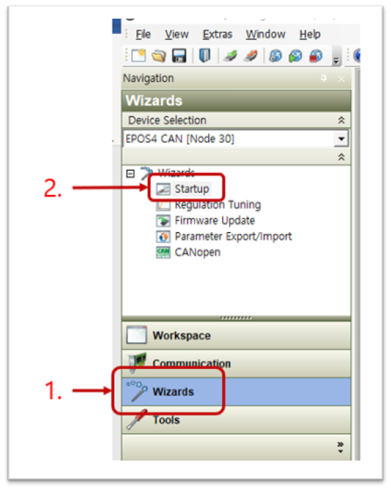

- Driver System / Motor
: 적용 모터에 맞게 설정(빨간 박스 항목) 후 Next
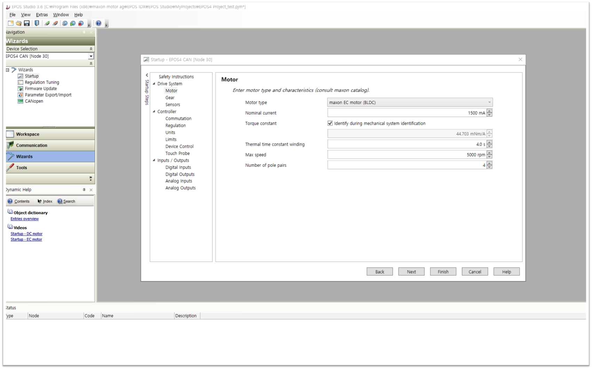

- Driver System / Sensor 
: Hall sensor 만 활성화(빨간 박스 항목) 후 Next
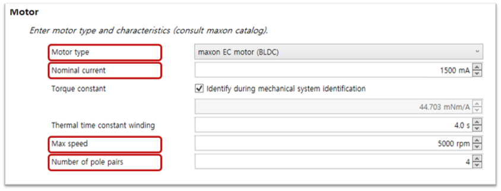

- Driver System / Sensor 
: Hall Sensor 만 활성화(빨간 박스 항목) 후 Next

- Controller / Commutation, Regulation, Units 
: 설정 확인 후 Next
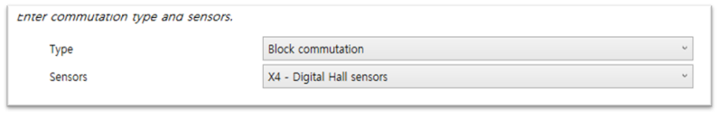

- Controller / Limits 
: 적용 모터에 맞게 설정(빨간 박스 항목) 후 Next
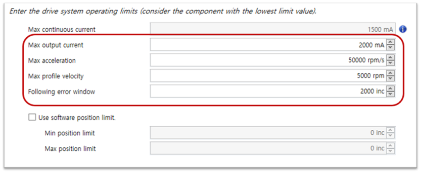

- Controller / Device Control 
: 적용 모터에 맞게 설정(빨간 박스 항목) 후 Next
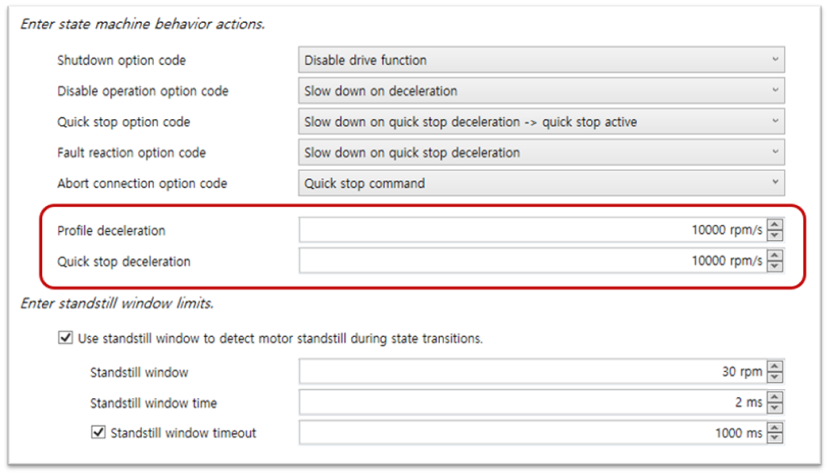

- Controller / Touch Prove : 설정 없이 패스 

- Inputs / Outputs 
: 모든 input / output  None 으로 설정
: 기능은 추가 테스트 후 적용 예정

- 모든 설정 완료 후 Finish 선택

#### 5.2.3.4 Driver Auto Tune

    <iframe src="https://player.vimeo.com/video/233980987" frameborder="0" allowfullscreen style="position: absolute; top: 0; left: 0; width: 100%; height: 100%;"></iframe>

- Wizard / Regulation Tuning 선택

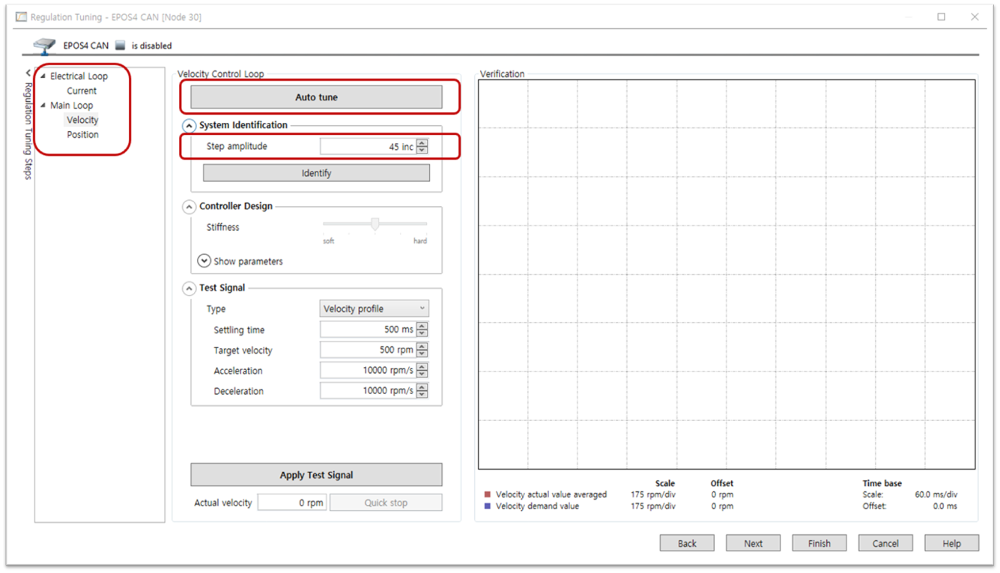

- Electrical Loop / Current 
: Step amplitude 값 설정(적절하고 실제 모션범위와 비슷한 값) 후 Auto Tune 선택  

- Main Loop / Velocity
: Step amplitude 값 설정(적절하고 실제 모션범위와 비슷한 값) 후 Auto Tune 선택

- Main Loop / Position
: Step amplitude 값 설정(적절하고 실제 모션범위와 비슷한 값) 후 Auto Tune 선택

- Error 
: 최대 전류값을 모터 스펙과 다르게 높게 잡았을 경우 에러 발생(-> 최대 전류값 조정)

#### 5.2.3.5 CAN 설정

- Tools / Object Dictionary 선택
- 0x2001 CAN bit rate : 1000 kbit/s 로 설정

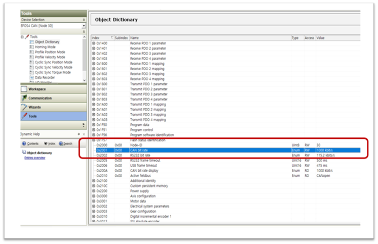

#### 5.2.3.6 테스트 및 추가 튜닝
- Wizard / Regulation Tuning 선택
- Test Signal 설정 후 Apply Test Signal 선택 
- 토크 제어 구동 테스트 
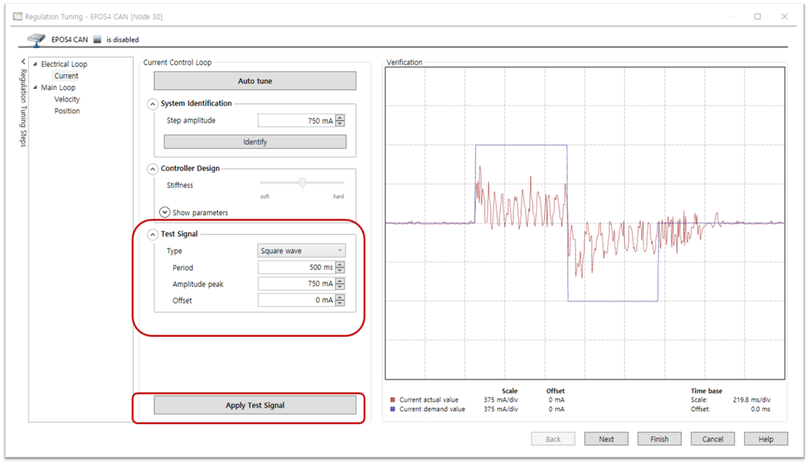

- 속도 제어 구동 테스트

- 위치 제어 구동 테스트

####  5.2.3.7 Parameter Export/Import

    <iframe src="https://player.vimeo.com/video/296015631" frameborder="0" allowfullscreen style="position: absolute; top: 0; left: 0; width: 100%; height: 100%;"></iframe>

- Parameter Export

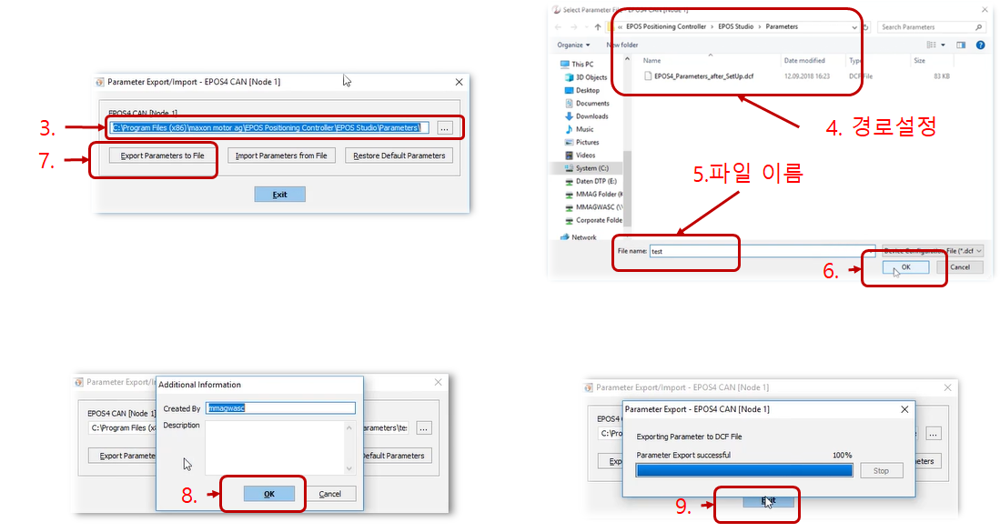

- Parameter Import

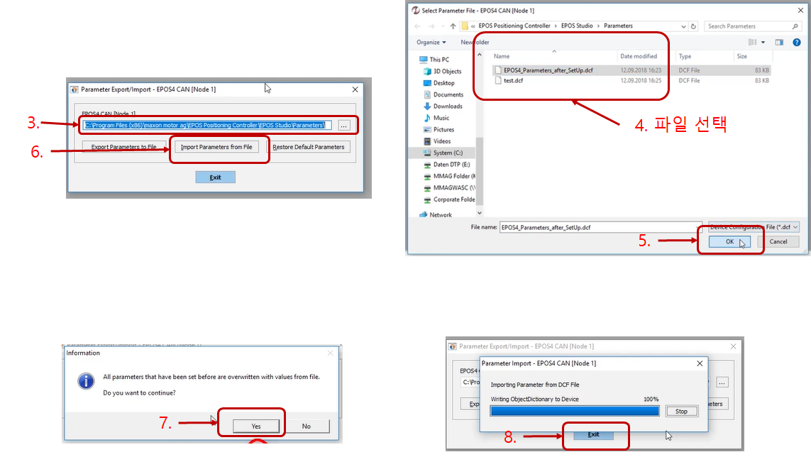

## 5.3 RC Servo Motor Setting

### 5.3.1 Range Set
    구동 범위 변경 시 사용

- RC 모터 최초 사용시 모터의 LEFT/RIGHT 구동범위를 최소범위로 변경해서 사용 : 모터 구동범위 0~4095

### 5.3.2 작동 TEST
    모터 수동 조작 시 사용

### 5.3.3 Motor Direction
    모터 회전 방향 변경 시 사용

### 5.3.4 공장초기화
    모터의 공장 초기화 설정으로 변경하고자 할 때 사용

