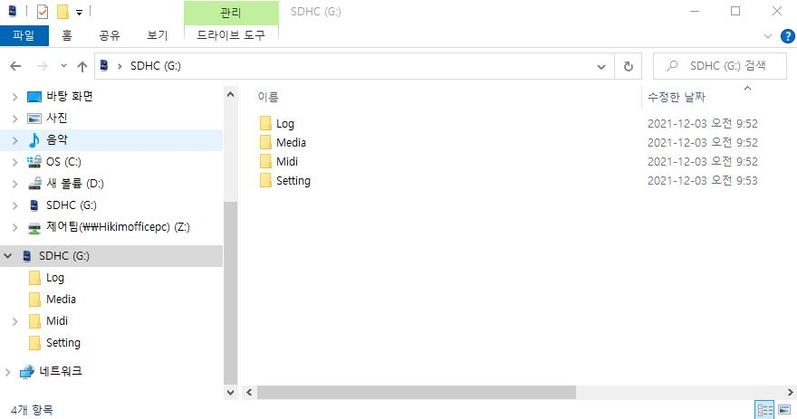
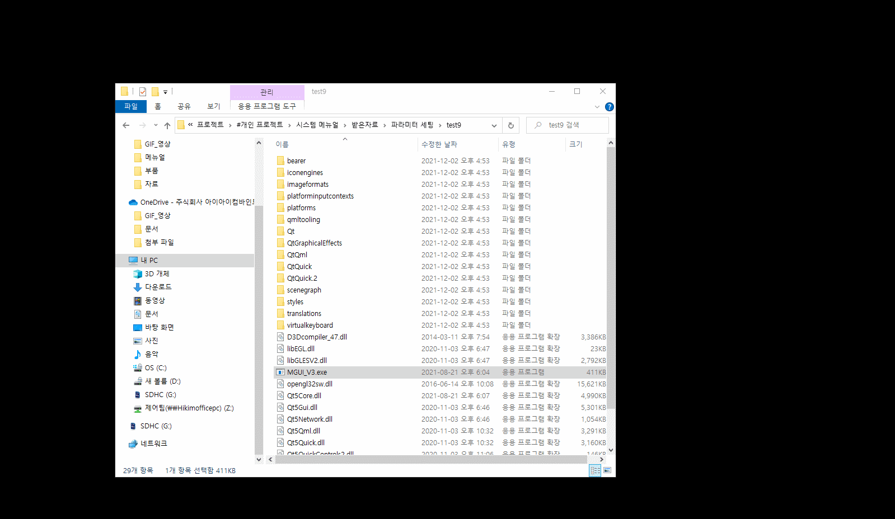
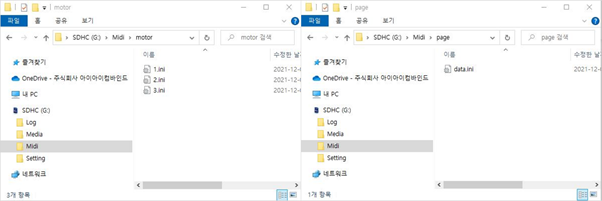
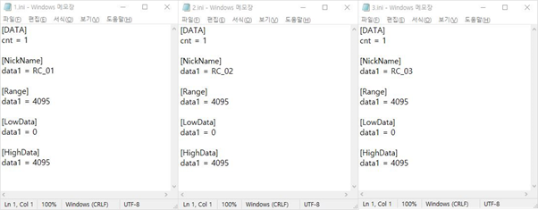
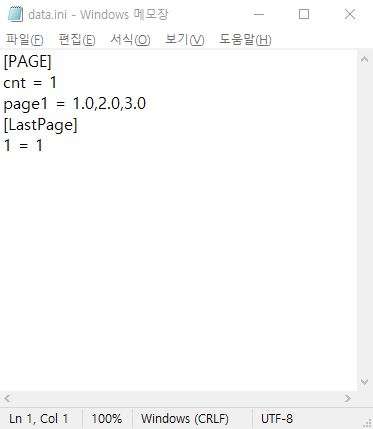
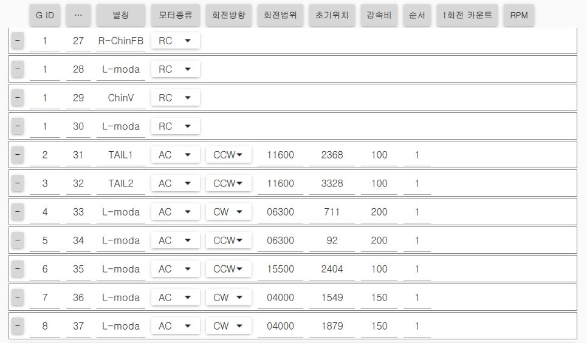
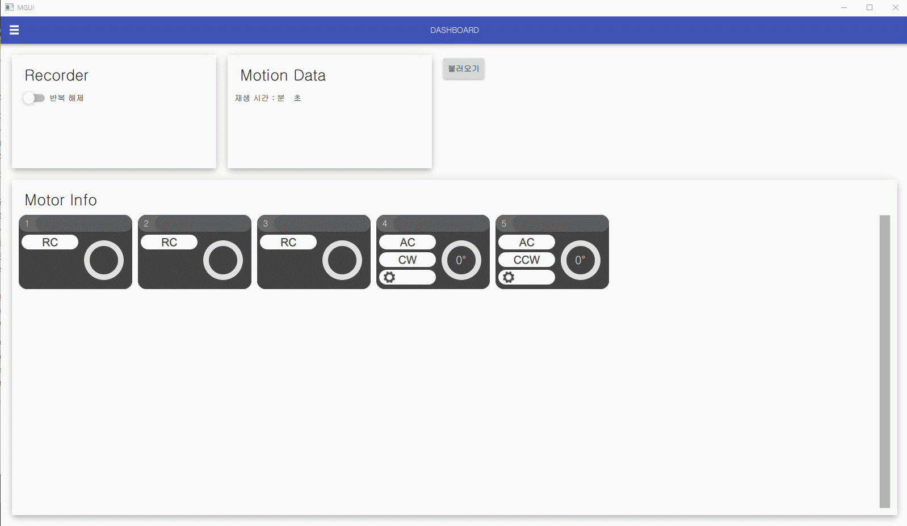

# Parameter Setting
## 6.1 파라미터 설정
    PC프로그램 : MGU V3.exe(버전 test9)
### 6.1.1 설정 파일
### 6.1.2 폴더 생성
    메모리 카드에 초기 조건을 충족시키기 위한 설정 폴더를 만든다(영상 참조)

|폴더|내용|
|:-:|:-:|
|Log|로그 데이터 저장|
|Media|모션데이터 저장|
|Setting|파라미터 설정 데이터 저장|
|Midi|MIDI 설정 데이터 저장(모터 설정, MIDI 페이지 설정)

#### 6.1.1.2 파일 생성
메모리카드의 해당파일에 설정 파일을 만들고 설정 값을 입력 후 저장한다.
//경로: SDHC(G:)
/ Midi / motor폴더 / 1.ini, 2.ini, 3.ini 메모장 생성
/ Midi / page폴더 / data.ini 메모장 생성

motor 폴더 / 1.ini, 2.ini, 3.ini 입력 및 저장

page폴더 / data.ini 입력 및 저장 

### 6.1.3 모터설정
#### 6.1.2.1 모터 설정

|분류|내용|
|:---:|:---:|
|G ID|그룹 ID|
|...|모터의 축 번호(ID)를 의미|
|별칭|모터 축 이름|
|모터종류|모터 종류 선택(RC Servo Motor,AC Servo Motor, BLDC Motor|
|회전방향|모터의 원점 설정을 위한 방향(예:CW, CCW)|
|회전범위|모터의 구동이 가능한 범위 (예: 30.7° → 03070, 180.5° →18050)|
|초기위치|원점센서 감지후 초기에 있어야할 위치(0~4095)|
|감속비|모터의 감속비(예:1/100->100)|
|순서|모터의 초기 위치 세팅 우선순위(선택)|
|1회전 카운터|(BLDC 사용시 사용)|
|RPM|(BLDC 사용시 사용)|

#### 6.1.2.2 RC Servo Motor 범위 설정
    움직이는 범위를 설정/저장한다.

사용가능 범위는 0~4095 
AC의 범위 설정은 [모터설정]에서 설정한다.

---------------------------------------
## 1. RC

## 2. AC

## 3. BLDC

## 4. PC Progam

## 5. Touch PAD
