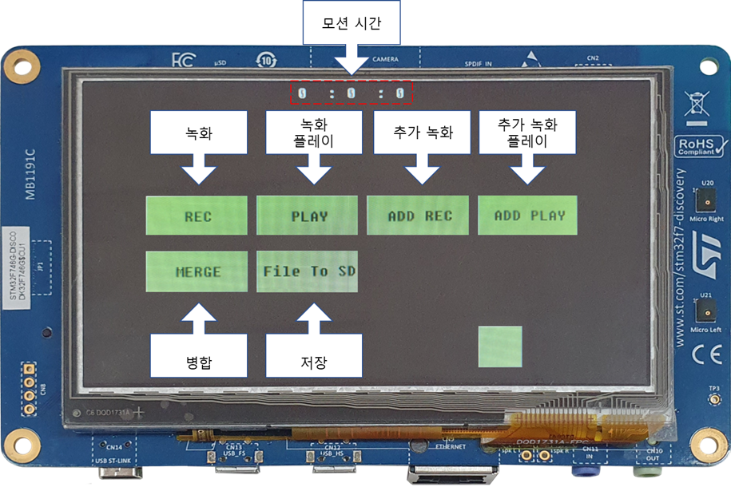

# Function
    모션 녹화 및 플레이
    모터 범위 제한으로 원하는 모터 구동 범위내에서 움직이는 기능
    앱솔루트 엔코더를 이용한 모터 위치 기억 기능
    JOG 수동모드로 모터 수동 조작 가능 (예: 모터와 감속기 조립, 모터와 기구 조립, 센서 조립)
    다양한 모터 사용 가능.
    다수의 모터 동시에 사용 가능.

* 추가 영상
MIDI 슬라이드 슬로우 상황에 따른 기구 움직임 영상
MIDI 축 범위 설정에 따른 슬라이드 움직이는 범위 변경된 영상
MIDI 축 반전 기능. 기구가 대칭일 경우 슬라이드 축 반전 (슬라이드 동일방향으로 움직이는 영상) 
MIDI 축 ID 변경으로 원하는 축을 커스텀에서 사용 가능.

## 7.1 녹화기 기능

|버튼|기능|
|:---:|:---:|
|REC|녹화 시작 / 종료|
|PLAY|녹화 데이터 플레이|
|ADD REC|녹화 추가 시작 / 종료|
|ADD PLAY|녹화 추가 데이터 플레이|
|MERGE| 녹화 데이터 병합(여러 모터 축 녹화 종료 후 모션 데이터 병합)|
|File to SD|병합된 데이터 메모리 카드에 저장|

## 7.2 MIDI 기능
### 7.2.1 MIDI 구성 및 각부의 명칭

그림 7.2-1 슬라이드 구분/ 그림 7.2-2 조작부 명칭

MIDI는 사용자 정의 조종 축 할당이 가능한 슬라이드8세트로 구성 되어있습니다. (그림 7.2-1)
각각의 슬라이드는 독립적으로 동작합니다. 
슬라이드는 감도설정, LCD, 버튼, 슬라이드로 구성됩니다. (그림 7.2-2) 
* 감도설정 – 감도 0~13단계로 변경 가능한 회전 스위치입니다.
* LCD – 제어 목표 축 이름, 번호, 명령 위치 값 이 표시됩니다.
* 버튼 – ENABLE : 해당 슬라이드를 활성화 하는 버튼입니다.
* 슬라이드 – 입력장치 입니다. 맨손으로 조작하세요

### 7.2.2 슬라이드 기본화면 세부 명칭

* 필터설정 

* 활성/비활성 0~4095 범위

### 7.2.3 편의 기능 Setting
* Setting Mode 진입 방법

## 1. Axis Range Set

## 2. Recording
터치 화면 - 종성

## 3. Motion Capture

### 3-1. Slide Type
MIDI 화면 - 종성
리미트설정
아이디 설정
레인지 변경 -

## 4. JOG
JOG 페이지 화면캡쳐  - CMD 설명 - 종성

