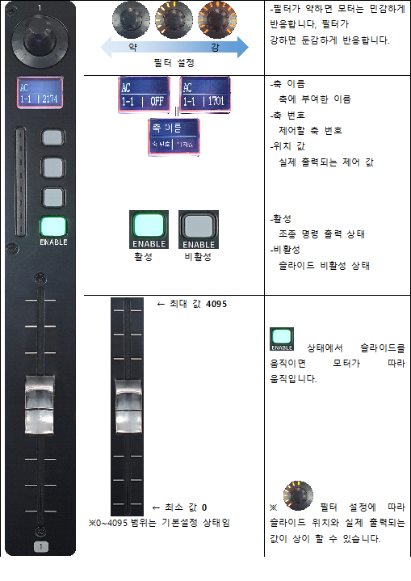
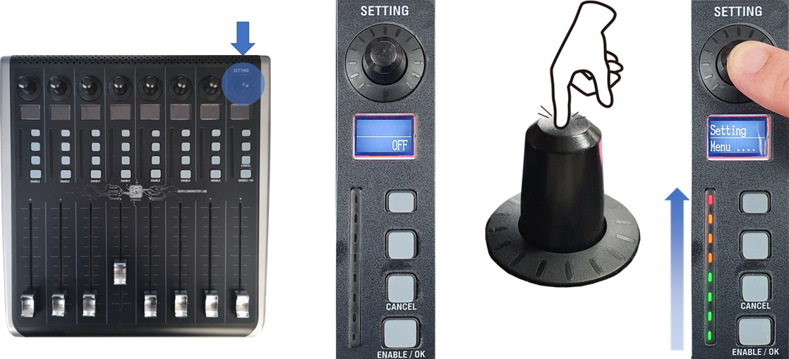
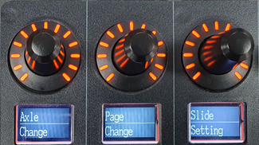
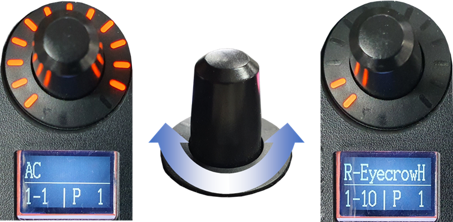
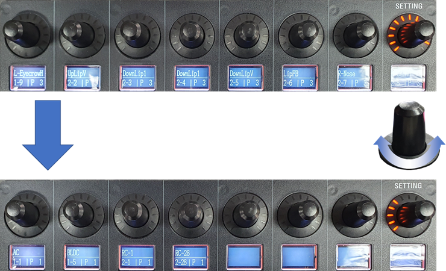
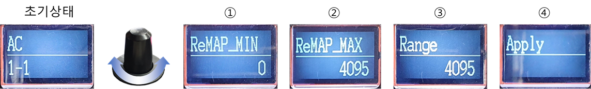
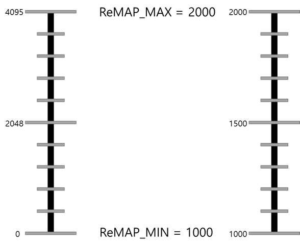
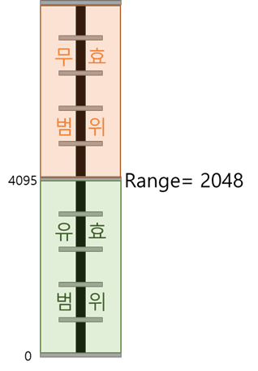

# Function
    모션 녹화 및 플레이
    모터 범위 제한으로 원하는 모터 구동 범위내에서 움직이는 기능
    앱솔루트 엔코더를 이용한 모터 위치 기억 기능
    JOG 수동모드로 모터 수동 조작 가능 (예: 모터와 감속기 조립, 모터와 기구 조립, 센서 조립)
    다양한 모터 사용 가능.
    다수의 모터 동시에 사용 가능.

* 추가 영상
MIDI 슬라이드 슬로우 상황에 따른 기구 움직임 영상
MIDI 축 범위 설정에 따른 슬라이드 움직이는 범위 변경된 영상
MIDI 축 반전 기능. 기구가 대칭일 경우 슬라이드 축 반전 (슬라이드 동일방향으로 움직이는 영상) 
MIDI 축 ID 변경으로 원하는 축을 커스텀에서 사용 가능.

## 7.1 녹화기 기능

|버튼|기능|
|:---:|:---:|
|REC|녹화 시작 / 종료|
|PLAY|녹화 데이터 플레이|
|ADD REC|녹화 추가 시작 / 종료|
|ADD PLAY|녹화 추가 데이터 플레이|
|MERGE| 녹화 데이터 병합(여러 모터 축 녹화 종료 후 모션 데이터 병합)|
|File to SD|병합된 데이터 메모리 카드에 저장|

## 7.2 MIDI 기능
### 7.2.1 MIDI 구성 및 각부의 명칭

그림 7.2-1 슬라이드 구분/ 그림 7.2-2 조작부 명칭

MIDI는 사용자 정의 조종 축 할당이 가능한 슬라이드8세트로 구성 되어있습니다. (그림 7.2-1)
각각의 슬라이드는 독립적으로 동작합니다. 
슬라이드는 감도설정, LCD, 버튼, 슬라이드로 구성됩니다. (그림 7.2-2) 
* 감도설정 – 감도 0~13단계로 변경 가능한 회전 스위치입니다.
* LCD – 제어 목표 축 이름, 번호, 명령 위치 값 이 표시됩니다.
* 버튼 – ENABLE : 해당 슬라이드를 활성화 하는 버튼입니다.
* 슬라이드 – 입력장치 입니다. 맨손으로 조작하세요

### 7.2.2 슬라이드 기본화면 세부 명칭

* 필터설정 

* 활성/비활성 0~4095 범위

### 7.2.3 편의 기능 Setting
* Setting Mode 진입 방법
 
그림 7.2 3 Setting 모드 진입 버튼

 
그림 7.2 4 Setting 모드 진입 상태

8번 슬라이드 감도조절 버튼을(그림 7.2-3) 3초간 누르면 Setting mode로 진입합니다.(그림 7.2-4)
* Axle Change – 각 슬라이드가 조종할 축을 변경합니다.
* Page Change – 8개 슬라이드에 동시에 할당된 축 묶음을 Page라 하며, Page Change에서 Page 단위로 전환 할 수 있습니다.
* Slide Setting – 슬라이드의 최소, 최대값, 슬라이드 유효구간을 설정합니다.
※ 진입하고 싶은 모드의 감도조절 버튼을 짧게 누르면 해당 모드로 진입합니다.
※ 세부 설정 모드로 진입하면 맨 우측 버튼이 OK, CANCEL 기능으로 변경됩니다.

* Axle Change
 
그림 7.2 5 할당된 축 변경

Axle Change 모드에 진입하면 감도조절 회전을 통해 할당된 축을 변경할 수 있습니다.(그림 7.2-5)
표시되는 축은 녹화기 SD CARD에 사전 지정된 정보를 토대로 출력됩니다.
변경사항을 적용하려면 OK를, 변경 취소하려면 CANCEL 을 눌러 기본화면으로 빠져나옵니다.

* Page Change

 
Page Change 모드에 진입하면 8번 슬라이드 감도조절 버튼 회전을 통해 Page를 
전환 할 수 있습니다.
변경사항을 적용하려면 OK 를, 변경 취소하려면 CANCEL  을 눌러 기본화면으로 빠져나옵니다. 
※Page를 지정한 후 Axle Change 에서 Page에 할당된 축을 변경 할 수 있습니다. 
※새로운 Page추가는 SD CARD에 사전 지정해야 합니다.

* Slide Setting
 
그림 7.2 7 Slide Setting 4단계 

Slide Setting 은 총 4단계 “최소위치 맵핑>최대위치 맵핑>가동범위 설정>적용” 으로 진행됩니다.(그림 7.2-7)
설정 값 입력은 각 단계에서 슬라이드 조작 > 버튼회전 으로 입력합니다.

최소/최대위치 맵핑 
슬라이드의 최소/최대 위치에서 출력될 값을 지정합니다.

 
그림 7.2 8 맵핑 예시 

최소 = 1000, 최대 = 2000 으 로 설정하면, 슬라이드 위치가 최저점일 때 1000이, 중간일때 1500, 최대지점에서 2000이 출력됩니다.(그림 7.2-8) 
※설정 값 을 “최소 > 최대” 가 되도록 설정하면 슬라이드 최소점에서 ReMAP_MAX값이, 최대지점에서 ReMAP_MIN 값이 출력됩니다

* 슬라이드 가동범위 설정
슬라이드 최대지점을 제한하여 가동범위를 조정 합니다.

 
그림 7.2 9 슬라이드 가동범위 제한 

Range에 설정된 값의 위치에서 슬라이드 유효 가동범위가 설정 됩니다.(그림 7.2-9)
슬라이드는 유효범위 내에서만 제어명령을 출력하며, 무효범위에서는 ReMAP_MAX 값에 멈춰 있습니다.
※작은 손동작으로 빠른 제어결과를 원할 때 활용합니다.

* 적용
설정을 마친 슬라이드를 "4단계 Apply" 에 두고 OK를 누르면 설정 값이 적용됩니다. 
※마지막 Apply 단계에 놓이지 않은 슬라이드는 설정 값이 적용되지 않습니다. 
※다수의 슬라이드를 설정하고 Apply 단계에서 OK를 누르면 Apply단계의 모든 슬라이드 설정 값이 적용됩니다.

